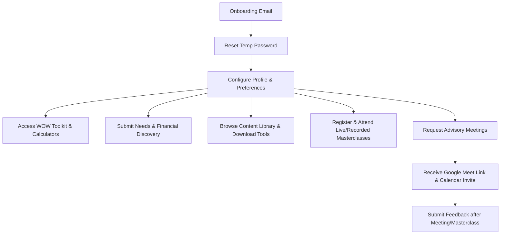
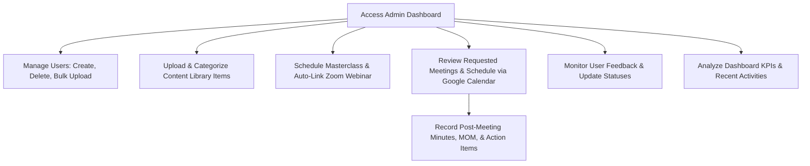
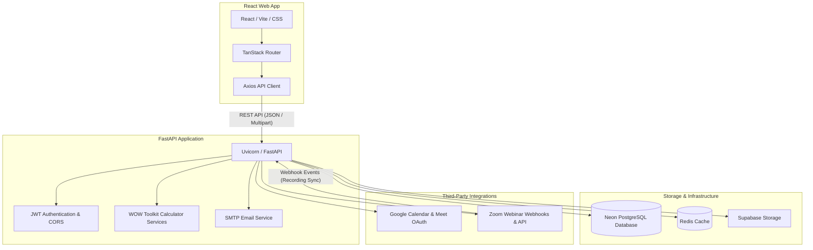

# Masterclass — Learning & Financial Freedom Platform.

Masterclass is a high-performance, premium web application built for wealth managers, advisors, and clients. It integrates structured learning via masterclasses, a shared content library, meeting scheduling with Google Calendar/Meet, automated notifications, feedback tracking, and a comprehensive suite of financial calculators called the **WOW Financial Freedom Toolkit**.

---

## 1. System Overview

### Purpose of Masterclass
Masterclass serves as a centralized hub that bridges the gap between financial advisors (Admins) and clients (Standard Users). The platform delivers high-value educational content, interactive tools for financial discovery and planning, and direct communication channels.

### Major Modules
1. **User Authentication & Management**: JWT-based authentication supporting normal login, temporary password resets, profile management, and multi-tenant organization classification. Includes bulk user imports via Excel.
2. **Content Library**: A secure, categorized repository for documents (PDFs, Excel templates, guides) stored in Supabase Storage with download and parsing capabilities.
3. **Masterclasses**: Scheduling, registration, and attendance tracking for webinars. Integrates with the Zoom API/Webhooks to automatically coordinate webinar creation, track registration, and sync cloud recording playbacks back to the database.
4. **Advisory Meetings**: An end-to-end booking flow where clients request meetings and Admins schedule them using Google Calendar API integration. It auto-creates Google Meet links, dispatches email invites, and records Minutes of Meetings (MOM) with action items.
5. **WOW Financial Freedom Toolkit**:
   - **Retirement Predictor**: Estimates required corpus based on inflation and savings rate sensitivity.
   - **Cost of Delay Calculator**: Visualizes the financial loss of delaying monthly SIP investments.
   - **SIP + Home Loan Impact**: Compares property ownership wealth generation vs. pure mutual fund compounding.
   - **Financial Freedom Date**: Determines the exact month/year when a user is projected to achieve financial independence.
   - **Goal Dashboard**: Aggregates target amounts, current savings, and SIP trackers across multiple personal goals.
   - **Family Vault**: Securely tracks family members, bank accounts, insurance policies, investments, loans, nominees, emergency contacts, and vital documents.
6. **Discovery Profiles**: Comprehensive **Needs Discovery** (risk profile, suitability analysis) and **Financial Discovery** (assets, liabilities, insurance, goals) profiles.
7. **System Notifications**: Dashboard and email-based notifications triggered by updates to meetings, masterclasses, uploads, and system events.

### User Flow (Standard Client / Advisor)


### Admin Flow (Super Admin / Organization Admin)


---

## 2. Architecture Diagram

Masterclass utilizes a modern decoupled frontend-backend architecture integrated with robust third-party cloud services.



### Architectural Component Interactions
1. **Frontend to Backend**: The React frontend communicates asynchronously with the FastAPI backend via REST API calls. Authentication is handled by passing a JWT in the `Authorization: Bearer` header.
2. **Database (Neon PostgreSQL)**: Database operations are orchestrated using `SQLAlchemy` with async drivers (`asyncpg`).
3. **Storage (Supabase Storage)**: PDF files, Excel worksheets, and tool uploads are stored in Supabase buckets. FastAPI handles validation and generates secure public URLs for the client.
4. **Zoom Webhooks**: When a webinar recording finishes on Zoom, a webhook dispatches a `recording.completed` event to the backend. The backend signs the webhook token, validates it against `ZOOM_WEBHOOK_SECRET`, downloads the MP4 link, updates the masterclass status, and emails registered attendees.
5. **Google OAuth & Calendar**: Administrators connect their Google account. FastAPI manages authorization codes, stores tokens, auto-refreshes them, and interacts with Google Calendar API to create invitations containing Google Meet URLs.
6. **Caching (Redis)**: Speeds up heavy read queries such as Admin KPI statistics and dashboard summaries.

---

## 3. Database Documentation

Masterclass's Neon PostgreSQL database schema consists of the following core tables, relationships, and constraints. All dates are persisted in UTC with timezones.
### Users Management Schema

#### `users` Table
Stores authentication details, profile configurations, organizational membership, and notifications preferences.
*   `id`: `Integer` (Primary Key, autoincrement)
*   `full_name`: `String(255)` (Not Null)
*   `email`: `String(255)` (Unique, Indexed, Not Null)
*   `hashed_password`: `String(255)` (Not Null)
*   `role`: `String(50)` (Default: `"user"`. Allowed: `"admin"`, `"user"`)
*   `company_name`: `String(255)` (Nullable)
*   `organization_id`: `Integer` (Foreign Key -> `organizations.id` ON DELETE CASCADE, Nullable)
*   `is_active`: `Boolean` (Default: `True`, Not Null)
*   `is_temp_password`: `Boolean` (Default: `False`, Not Null)
*   `created_at`: `DateTime(timezone=True)` (Default: Current Timestamp)
*   `department`: `String(255)` (Nullable)
*   `years_of_experience`: `Integer` (Nullable)
*   `number_of_clients`: `Integer` (Nullable)
*   `aum`: `String(255)` (Nullable)
*   `products_dealt_with`: `String(1000)` (Nullable)
*   `designation`: `String(255)` (Nullable)
*   `phone`: `String(50)` (Nullable)
*   `profile_photo`: `Text` (Nullable)
*   `pref_masterclass_notifications`: `Boolean` (Default: `True`, Not Null)
*   `pref_email_notifications`: `Boolean` (Default: `True`, Not Null)
*   `pref_recording_notifications`: `Boolean` (Default: `True`, Not Null)

#### `organizations` Table
Supports grouping users into corporate networks.
*   `id`: `Integer` (Primary Key, autoincrement)
*   `organization_name`: `String(255)` (Unique, Not Null)
*   `created_at`: `DateTime(timezone=True)` (Default: Current Timestamp)
*   `phone`: `String(255)` (Nullable)
*   `website`: `String(255)` (Nullable)
*   `number_of_employees`: `Integer` (Nullable)

---

### Content Library Schema

#### `content_categories` Table
Manages the organization folders of the content library.
*   `id`: `Integer` (Primary Key, autoincrement)
*   `name`: `String(255)` (Unique, Indexed, Not Null)
*   `created_at`: `DateTime(timezone=True)` (Default: Current Timestamp)

#### `content_library` Table
Tracks uploaded documents and spreadsheet tools.
*   `id`: `Integer` (Primary Key, autoincrement)
*   `title`: `String(255)` (Not Null)
*   `description`: `Text` (Nullable)
*   `category`: `String(255)` (Not Null)
*   `file_type`: `String(50)` (Not Null)
*   `file_size`: `String(50)` (Not Null)
*   `storage_path`: `String(500)` (Not Null)
*   `public_url`: `String(1000)` (Not Null)
*   `uploaded_by`: `String(255)` (Not Null)
*   `uploaded_at`: `DateTime(timezone=True)` (Default: Current Timestamp)
*   `is_active`: `Boolean` (Default: `True`, Not Null)
*   `storage_provider`: `String(100)` (Default: `"Supabase"`, Nullable)
*   `bucket_name`: `String(255)` (Default: Resolves from `.env`, Nullable)
*   `original_filename`: `String(500)` (Nullable)
*   `storage_filename`: `String(500)` (Nullable)
*   `mime_type`: `String(255)` (Nullable)
*   `folder`: `String(255)` (Default: `"General"`, Nullable)

---

### Masterclasses & Recordings Schema

#### `masterclasses` Table
Tracks live and recorded training webinars.
*   `masterclass_id`: `Integer` (Primary Key, autoincrement)
*   `title`: `String(255)` (Not Null)
*   `description`: `String(2000)` (Nullable)
*   `speaker`: `String(255)` (Nullable)
*   `scheduled_at`: `DateTime(timezone=True)` (Not Null)
*   `duration_minutes`: `Integer` (Not Null)
*   `zoom_webinar_id`: `String(255)` (Nullable)
*   `zoom_join_url`: `String(1000)` (Nullable)
*   `zoom_start_url`: `String(1000)` (Nullable)
*   `status`: `String(50)` (Default: `"upcoming"`. Allowed: `"upcoming"`, `"live"`, `"completed"`, `"recorded"`, `"cancelled"`)
*   `recording_filename`: `String(500)` (Nullable)
*   `recording_url`: `String(1000)` (Nullable)
*   `thumbnail_url`: `String(1000)` (Nullable)
*   `category`: `String(255)` (Nullable)
*   `tags`: `String(1000)` (Nullable)
*   `learning_outcomes`: `String(2000)` (Nullable)
*   `max_attendees`: `Integer` (Nullable)
*   `visibility`: `String(50)` (Default: `"public"`. Allowed: `"public"`, `"private"`, `"draft"`)
*   `source`: `String(50)` (Default: `"edustream"`, Not Null)
*   `created_at`: `DateTime(timezone=True)` (Default: Current Timestamp)

#### `masterclass_recordings` Table
Maintains records of webinar videos synced from Zoom webhook.
*   `id`: `Integer` (Primary Key, autoincrement)
*   `masterclass_id`: `Integer` (Foreign Key -> `masterclasses.masterclass_id` ON DELETE CASCADE, Not Null)
*   `zoom_webinar_id`: `String(255)` (Not Null)
*   `recording_url`: `String(1000)` (Not Null)
*   `duration_minutes`: `Integer` (Not Null)
*   `thumbnail_url`: `String(1000)` (Nullable)
*   `recording_date`: `DateTime(timezone=True)` (Nullable)
*   `created_at`: `DateTime(timezone=True)` (Default: Current Timestamp)

#### `masterclass_registrations` Table
User registrations for upcoming masterclasses.
*   `id`: `Integer` (Primary Key, autoincrement)
*   `masterclass_id`: `Integer` (Foreign Key -> `masterclasses.masterclass_id` ON DELETE CASCADE, Not Null)
*   `user_id`: `Integer` (Foreign Key -> `users.id` ON DELETE CASCADE, Not Null)
*   `registered_at`: `DateTime(timezone=True)` (Default: Current Timestamp)

#### `masterclass_watch_history` Table
Tracks user progress when watching recorded masterclasses.
*   `id`: `Integer` (Primary Key, autoincrement)
*   `masterclass_id`: `Integer` (Foreign Key -> `masterclasses.masterclass_id` ON DELETE CASCADE, Not Null)
*   `user_id`: `Integer` (Foreign Key -> `users.id` ON DELETE CASCADE, Not Null)
*   `last_position_seconds`: `Float` (Default: `0.0`, Not Null)
*   `max_position_seconds`: `Float` (Default: `0.0`, Not Null)
*   `completion_percentage`: `Float` (Default: `0.0`, Not Null)
*   `updated_at`: `DateTime(timezone=True)` (Default: Current Timestamp, updates on edit)

#### `masterclass_email_logs` Table
Audit logs of transactional emails dispatched for a masterclass.
*   `id`: `Integer` (Primary Key, autoincrement)
*   `user_id`: `Integer` (Foreign Key -> `users.id` ON DELETE CASCADE, Not Null)
*   `webinar_id`: `Integer` (Foreign Key -> `masterclasses.masterclass_id` ON DELETE CASCADE, Not Null)
*   `email_type`: `String(50)` (Not Null. E.g., `"scheduled"`, `"reminder_24h"`, `"recording_available"`)
*   `sent_at`: `DateTime(timezone=True)` (Default: Current Timestamp)
*   `status`: `String(50)` (Default: `"success"`, Not Null)

---

### Google Integrations & Meetings Schema

#### `google_integrations` Table
Holds Google API credentials needed for Super Admin Calendar scheduling.
*   `id`: `Integer` (Primary Key, autoincrement)
*   `google_email`: `String(255)` (Not Null)
*   `access_token`: `Text` (Not Null)
*   `refresh_token`: `Text` (Nullable)
*   `token_expiry`: `DateTime(timezone=True)` (Not Null)
*   `created_at`: `DateTime(timezone=True)` (Default: Current Timestamp)
*   `updated_at`: `DateTime(timezone=True)` (Default: Current Timestamp, updates on edit)

#### `meetings` Table
Tracks meeting bookings, statuses, and generated video links.
*   `id`: `Integer` (Primary Key, autoincrement)
*   `title`: `String(255)` (Not Null)
*   `agenda`: `Text` (Nullable)
*   `requested_by_user_id`: `Integer` (Foreign Key -> `users.id` ON DELETE CASCADE, Not Null)
*   `requested_to_user_id`: `Integer` (Foreign Key -> `users.id` ON DELETE SET NULL, Nullable)
*   `organization_id`: `Integer` (Foreign Key -> `organizations.id` ON DELETE CASCADE, Nullable)
*   `meeting_date`: `String(100)` (Not Null)
*   `start_time`: `String(100)` (Not Null)
*   `end_time`: `String(100)` (Not Null)
*   `google_event_id`: `String(255)` (Nullable)
*   `google_meet_link`: `String(1000)` (Nullable)
*   `status`: `String(50)` (Default: `"pending"`. Allowed: `"pending"`, `"accepted"`, `"scheduled"`, `"completed"`, `"cancelled"`)
*   `notes`: `Text` (Nullable)
*   `action_items`: `Text` (Nullable)
*   `next_steps`: `Text` (Nullable)
*   `created_at`: `DateTime(timezone=True)` (Default: Current Timestamp)
*   `updated_at`: `DateTime(timezone=True)` (Default: Current Timestamp, updates on edit)

---

### Discovery & Feedback Schema

#### `needs_discovery_profiles` Table
Stores client needs assessment and risk profiles.
*   `id`: `Integer` (Primary Key, autoincrement)
*   `user_id`: `Integer` (Unique, Indexed, Not Null)
*   `organization_id`: `Integer` (Nullable)
*   `client_discovery_json`: `JSON` (Nullable)
*   `risk_calculator_json`: `JSON` (Nullable)
*   `suitability_check_json`: `JSON` (Nullable)
*   `dashboard_json`: `JSON` (Nullable)
*   `created_at`: `DateTime(timezone=True)` (Default: Current Timestamp)
*   `updated_at`: `DateTime(timezone=True)` (Default: Current Timestamp, updates on edit)

#### `financial_discovery_profiles` Table
Stores detailed client balance sheets and asset registers.
*   `id`: `Integer` (Primary Key, autoincrement)
*   `user_id`: `Integer` (Unique, Indexed, Not Null)
*   `organization_id`: `Integer` (Nullable)
*   `client_master_json`: `JSON` (Nullable)
*   `assets_json`: `JSON` (Nullable)
*   `liabilities_json`: `JSON` (Nullable)
*   `insurance_json`: `JSON` (Nullable)
*   `goals_json`: `JSON` (Nullable)
*   `advisor_json`: `JSON` (Nullable)
*   `created_at`: `DateTime(timezone=True)` (Default: Current Timestamp)
*   `updated_at`: `DateTime(timezone=True)` (Default: Current Timestamp, updates on edit)

#### `feedback` Table
Saves feedback ratings, reviews, and categories.
*   `id`: `Integer` (Primary Key, autoincrement)
*   `user_id`: `Integer` (Foreign Key -> `users.id` ON DELETE CASCADE, Not Null)
*   `feedback_type`: `String(100)` (Not Null. E.g., `"Masterclass"`, `"Meeting"`, `"Platform Feedback"`)
*   `session_id`: `String(255)` (Nullable)
*   `session_title`: `String(255)` (Nullable)
*   `rating`: `Integer` (Not Null. Range: 1 to 5)
*   `category`: `String(100)` (Not Null. E.g., `"Content Quality"`, `"Technical Experience"`)
*   `comment`: `String(2000)` (Not Null)
*   `would_recommend`: `Boolean` (Default: `True`, Not Null)
*   `status`: `String(50)` (Default: `"Submitted"`. Allowed: `"Submitted"`, `"Reviewed"`, `"Resolved"`)
*   `created_at`: `DateTime(timezone=True)` (Default: Current Timestamp)

#### `notifications` Table
Stores real-time system alerts.
*   `id`: `Integer` (Primary Key, autoincrement)
*   `user_id`: `Integer` (Foreign Key -> `users.id` ON DELETE CASCADE, Nullable - Null represents system-wide notifications)
*   `title`: `String(255)` (Not Null)
*   `message`: `String(1000)` (Not Null)
*   `type`: `String(100)` (Not Null. E.g., `"meeting"`, `"masterclass"`, `"tool"`, `"system"`)
*   `reference_id`: `String(255)` (Nullable)
*   `is_read`: `Boolean` (Default: `False`, Not Null)
*   `created_at`: `DateTime(timezone=True)` (Default: Current Timestamp)

---

### Tools & WOW Calculators Schema

#### `tools_registry` Table
Catalogs offline spreadsheet templates and interactive apps available to download.
*   `id`: `Integer` (Primary Key, autoincrement)
*   `name`: `String(255)` (Unique, Indexed, Not Null)
*   `description`: `Text` (Not Null)
*   `type`: `String(50)` (Not Null. E.g., `"interactive"`, `"downloadable"`)
*   `file_path`: `String(500)` (Nullable)
*   `original_filename`: `String(500)` (Nullable)
*   `storage_filename`: `String(500)` (Nullable)
*   `icon_name`: `String(50)` (Default: `"TrendingUp"`, Not Null)
*   `is_active`: `Boolean` (Default: `True`, Not Null)
*   `created_at`: `DateTime(timezone=True)` (Default: Current Timestamp)
*   `updated_at`: `DateTime(timezone=True)` (Default: Current Timestamp, updates on edit)

#### `financial_goals` Table
Standard target metrics for clients' goals dashboard.
*   `id`: `Integer` (Primary Key, autoincrement)
*   `user_id`: `Integer` (Indexed, Not Null)
*   `name`: `String(255)` (Not Null)
*   `target_amount`: `Float` (Not Null)
*   `current_saved`: `Float` (Not Null)
*   `monthly_sip`: `Float` (Not Null)
*   `timeline_years`: `Float` (Not Null)
*   `created_at`: `DateTime(timezone=True)` (Default: Current Timestamp)

#### `vault_family_members` Table
*   `id`: `Integer` (Primary Key)
*   `user_id`: `Integer` (Indexed)
*   `name`: `String(255)`
*   `relationship`: `String(100)`
*   `dob`: `String(100)`
*   `pan_number`: `String(100)` (Nullable)
*   `aadhaar_last_four`: `String(20)` (Nullable)
*   `blood_group`: `String(20)` (Nullable)
*   `created_at`: `DateTime` (Default: Now)

*Note: Similar schemas exist for other Vault collections including `vault_insurance_policies`, `vault_investments`, `vault_important_documents`, `vault_emergency_contacts`, `vault_bank_accounts`, `vault_loans`, and `vault_nominees`.*

#### `wow_user_inputs` Table
Caches the client's entries for the interactive toolkit.
*   `id`: `Integer` (Primary Key, autoincrement)
*   `user_id`: `Integer` (Unique, Indexed, Not Null)
*   `retirement_inputs`: `JSON` (Nullable)
*   `cost_of_delay_inputs`: `JSON` (Nullable)
*   `sip_home_loan_inputs`: `JSON` (Nullable)
*   `freedom_date_inputs`: `JSON` (Nullable)
*   `updated_at`: `DateTime(timezone=True)` (Default: Now, updates on edit)

---

## 4. API Documentation

### Prefix Context Reference
*   `/auth`: User registration, email credentials, login session, password management, and OAuth redirection.
*   `/users`: Profiles details, analytics summaries, and Excel sheet upload/template operations.
*   `/api/financial-discovery`: Financial profile read/write.
*   `/api/needs-discovery`: Needs profile read/write.
*   `/api/feedback`: Feedback submissions and ratings.
*   `/api/notifications`: Retrieve and read status operations.
*   `/api/masterclasses`: Masterclasses and Zoom links.
*   `/meetings`: In-app bookings and Google Calendar sync.
*   `/wow`: Interactive calculators, download templates, goals tracker, vault inputs, and calculation parameters.

### Comprehensive Endpoint Catalog

| HTTP Method | Endpoint URL | Description | Auth Requirement | Request Payload / Query Parameters | Response Structure |
| :--- | :--- | :--- | :--- | :--- | :--- |
| **POST** | `/auth/register` | Create a new user account | Public | `{ full_name, email, password, company_name }` | `{ id, email, full_name, role }` |
| **POST** | `/auth/login` | Login session verification | Public | `{ username (email), password }` (Form Data) | `{ access_token, token_type, role }` |
| **POST** | `/auth/change-password` | Resets a temporary password | User/Admin | `{ old_password, new_password }` | `{ success: true, message }` |
| **GET** | `/auth/google/callback` | Google OAuthCallback Receiver | Public | Query: `code` | Redirects to Frontend dashboard or prints error details |
| **GET** | `/users/me` | Fetch active user profile | User/Admin | None | `{ id, full_name, email, role, phone, profile_photo, ... }` |
| **PUT** | `/users/me` | Update active user profile parameters | User/Admin | `{ full_name, phone, profile_photo, department, ... }` | Updated profile payload |
| **GET** | `/users/super-dashboard-kpis` | Dashboard statistics & summaries | Admin Only | None | `{ total_organizations, total_documents, upcoming_meetings, ... }` |
| **GET** | `/users` | List all users in system | Admin Only | None | `List` of user management models |
| **POST** | `/users/create` | Manually register standard user | Admin Only | `{ full_name, email, role, company_name }` | Created user profile |
| **PUT** | `/users/{user_id}/update` | Update any user parameters | Admin Only | `{ full_name, email, role, company_name, is_active }` | Updated user profile |
| **PUT** | `/users/{user_id}/status` | Activate or deactivate user | Admin Only | `{ is_active }` | Updated user profile |
| **DELETE** | `/users/{user_id}` | Hard delete user | Admin Only | None | `{ success: true }` |
| **POST** | `/users/bulk-upload` | Import users via Excel spreadsheet | Admin Only | Multipart: `file` | `{ success: true, message, imported_count }` |
| **GET** | `/users/template-download` | Get empty Excel upload structure | Admin Only | None | Streams binary file (`users_bulk_import_template.xlsx`) |
| **GET** | `/content/categories` | Get all content categories | User/Admin | None | `List` of category objects |
| **POST** | `/content/categories` | Add a content category | Admin Only | `{ name }` | Created category object |
| **GET** | `/content/items` | Query content library documents | User/Admin | Query: `category` (optional) | `List` of ContentItem objects |
| **POST** | `/content/upload` | Upload new library document | Admin Only | Form: `title`, `description`, `category`. File: `file` | Upload details + Supabase URL |
| **GET** | `/content/download/{item_id}`| Proxy download library item | User/Admin | Query: `token` | Streams raw bytes from Supabase bucket |
| **DELETE**| `/content/items/{item_id}` | Delete document | Admin Only | None | `{ success: true }` |
| **GET** | `/api/needs-discovery` | Get needs discovery profile | User/Admin | None | `{ client_discovery_json, risk_calculator_json, ... }` |
| **PUT** | `/api/needs-discovery` | Update needs discovery profile | User/Admin | JSON payload with profile sections | `{ status: "success", message }` |
| **POST** | `/api/needs-discovery/reset` | Clear needs discovery profile | User/Admin | None | `{ status: "success", message }` |
| **GET** | `/api/financial-discovery`| Get financial discovery profile | User/Admin | None | `{ client_master_json, assets_json, liabilities_json, ... }` |
| **PUT** | `/api/financial-discovery`| Update financial discovery profile | User/Admin | JSON payload with balance sheet data | `{ status: "success", message }` |
| **POST** | `/api/financial-discovery/reset`| Clear financial discovery profile | User/Admin | None | `{ status: "success", message }` |
| **POST** | `/api/feedback` | Submit post-meeting/class feedback | User/Admin | `{ feedback_type, rating, category, comment, ... }` | Submitted feedback response |
| **GET** | `/api/feedback/my` | Get current user's feedback history| User/Admin | None | `List` of user's feedback entries |
| **GET** | `/api/feedback` | View all feedback received | Admin Only | None | `List` of all feedback with submitter email |
| **PUT** | `/api/feedback/{id}/status`| Update feedback status | Admin Only | `{ status }` (e.g. `"Reviewed"`, `"Resolved"`) | Updated feedback object |
| **GET** | `/api/notifications` | Get in-app notifications | User/Admin | None | `List` of notification objects |
| **POST** | `/api/notifications/read` | Mark specific notifications as read | User/Admin | `{ notification_ids }` | `{ detail: "Notifications marked as read." }` |
| **POST** | `/api/notifications/read-all`| Mark all notifications as read | User/Admin | None | `{ detail: "All notifications marked as read." }` |
| **GET** | `/api/masterclasses` | Query visible masterclasses | User/Admin | None | `List` of masterclasses (Standard users see public only) |
| **POST** | `/api/masterclasses` | Schedule new masterclass webinar | Admin Only | `{ title, scheduled_at, duration_minutes, speaker, ... }` | Created masterclass with Zoom join links |
| **PUT** | `/api/masterclasses/{id}` | Edit masterclass parameters | Admin Only | Fields to modify (title, date, Speaker, outcomes, tags) | Updated masterclass object |
| **DELETE**| `/api/masterclasses/{id}` | Hard delete masterclass | Admin Only | None | `{ success: true }` |
| **POST** | `/api/masterclasses/{id}/register`| Register user for masterclass | User/Admin | None | `{ success: true, message }` |
| **GET** | `/api/masterclasses/{id}/registrations`| Get masterclass registrants | Admin Only | None | `List` of registered users |
| **POST** | `/api/masterclasses/{id}/progress`| Update watch progress on recording | User/Admin | `{ last_position_seconds, max_position_seconds, ... }` | Updated progress object |
| **POST** | `/api/zoom/webhook` | Zoom Webinar webhook receiver | Public | Zoom Event webhook JSON signature | Challenge payload or `{ status: "success" }` |
| **GET** | `/meetings/users` | List users available to schedule | User/Admin | None | List of users (Users see admins, Admins see users) |
| **POST** | `/meetings/request` | Submit new meeting request | User/Admin | `{ title, agenda, requested_to_user_id, meeting_date, ... }` | Created meeting request (status `"pending"`) |
| **GET** | `/meetings/list` | List current user meetings | User/Admin | None | List of meetings based on role permissions |
| **POST** | `/meetings/{id}/schedule` | Approve & Schedule Google Calendar meeting| Admin Only | `{ title, agenda, meeting_date, start_time, end_time, attendees }`| Scheduled meeting object containing Google Meet link |
| **POST** | `/meetings/{id}/accept` | Accept meeting request | User/Admin | None | `{ message: "Meeting request accepted successfully." }` |
| **POST** | `/meetings/{id}/reject` | Reject/Cancel meeting request | User/Admin | None | `{ message: "Meeting request rejected/cancelled." }` |
| **POST** | `/meetings/{id}/complete` | Complete meeting mark | Admin Only | None | `{ message: "Meeting marked as completed successfully." }` |
| **POST** | `/meetings/{id}/notes` | Save meeting notes (MOM) | Admin Only | `{ notes, action_items, next_steps }` | Updated meeting notes object |
| **GET** | `/meetings/google/auth-url` | Get google auth redirect link | Admin Only | None | `{ auth_url }` |
| **GET** | `/meetings/google/callback` | Google OAuth callback receiver | Public | Query: `code` | Redirects to meetings page with connected flag |
| **GET** | `/meetings/google/status` | Read google integration state | Admin Only | None | `{ connected, email, token_valid }` |
| **POST** | `/meetings/google/disconnect`| Purge Google OAuth integrations | Admin Only | None | `{ status: "success" }` |
| **GET** | `/wow/tools` | Fetch calculators & offline templates | User/Admin | None | List of active tools from the registry |
| **POST** | `/wow/tools` | Add tool to registry | Admin Only | `{ name, description, type, file_path, icon_name, is_active }` | Created tool registry entry |
| **PUT** | `/wow/tools/{id}` | Update tool details | Admin Only | Updated parameters | Updated tool registry entry |
| **DELETE**| `/wow/tools/{id}` | Remove tool from registry | Admin Only | None | `{ success: true }` |
| **POST** | `/wow/tools/upload` | Upload spreadsheet template file | Admin Only | Multipart: `file` | Storage details + public download URL |
| **GET** | `/wow/tools/download/{id}` | Proxy download template file | User/Admin | Query: `token` | Streams raw bytes from Supabase bucket |
| **GET** | `/wow/tools/preview/{id}` | Parse & preview spreadsheet pages | User/Admin | None | First 3 sheets of Excel parsed into 2D JSON grid |
| **POST** | `/wow/retirement/calculate` | Calculate Retirement Predictor | Public | RetirementInput JSON structure | RetirementResult calculations & sensitivity table |
| **POST** | `/wow/cost-delay/calculate` | Calculate Cost of Delay | Public | DelayInput JSON structure | DelayResult SIP delays and penalty warnings |
| **POST** | `/wow/sip-home-loan/calculate`| Calculate SIP + Home Loan | Public | SipLoanInput JSON structure | SipLoanResult comparison series & recommendation |
| **POST** | `/wow/freedom-date/calculate` | Calculate Financial Freedom Date | Public | FreedomDateInput JSON structure | FreedomDateResult achievement year, milestone & series |
| **POST** | `/wow/goal-dashboard/calculate`| Calculate Goals Dashboard | Public | List of GoalItems JSON structure | GoalDashboardResult with goal percentages |
| **GET** | `/wow/goals` | Get goals from database | User/Admin | None | List of financial goals for current user |
| **POST** | `/wow/goals` | Add personal goal | User/Admin | Goal details | Created goal |
| **GET** | `/wow/vault` | Get family vault collections | User/Admin | None | Combined collections of family members, bank accounts, etc |
| **POST** | `/wow/inputs` | Cache calculator inputs | User/Admin | `{ retirement_inputs, cost_of_delay_inputs, ... }` | Cached inputs schema |

---

## 5. Docker Setup

You can run the entire application stack using Docker Compose. Ensure you have Docker and Docker Compose installed.

### Prerequisites
- [Docker](https://docs.docker.com/get-docker/) installed
- [Docker Compose](https://docs.docker.com/compose/install/) installed

### 1. Setup Environment Variables

Copy the `.env.example` files and populate them with your values:

```bash
cp backend/.env.example backend/.env
# Fill in: DATABASE_URL, SECRET_KEY, ALGORITHM, ACCESS_TOKEN_EXPIRE_MINUTES, FRONTEND_URL

cp frontend/.env.example frontend/.env
# Fill in: VITE_API_URL=http://localhost:8000
```

### 2. Build & Run with Docker Compose

```bash
docker-compose up --build
```

| Service | URL |
| :--- | :--- |
| **Frontend** | `http://localhost:5173` |
| **Backend API** | `http://localhost:8000` |
| **API Health Check** | `http://localhost:8000/health` |

### 3. Stop the Containers

```bash
docker-compose down
```

### Project Structure (with Docker files)

```text
project-root/
├── frontend/
│   ├── Dockerfile          # Multi-stage: Node build → Nginx serve
│   ├── .dockerignore
│   └── ...
├── backend/
│   ├── Dockerfile          # Python 3.11-slim + uvicorn
│   ├── .dockerignore
│   └── ...
└── docker-compose.yml      # Orchestrates frontend + backend
```